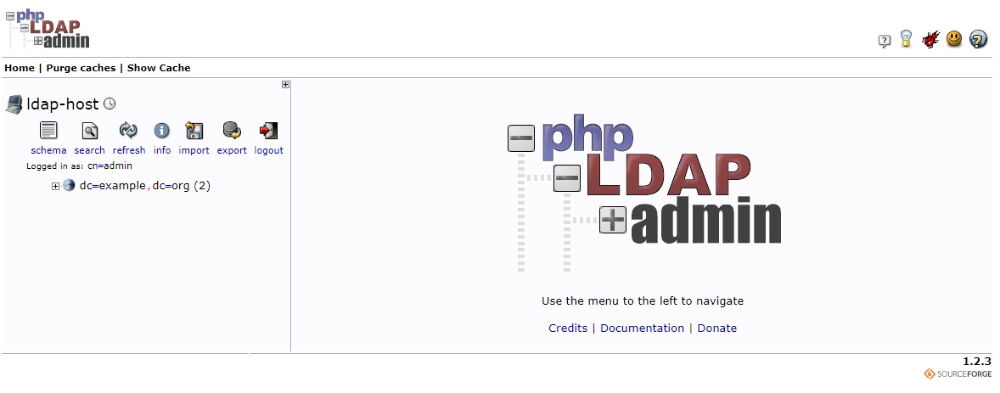
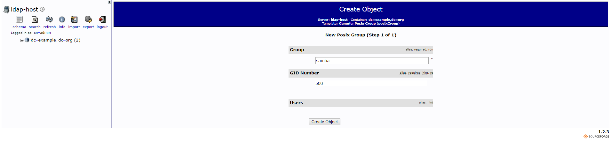
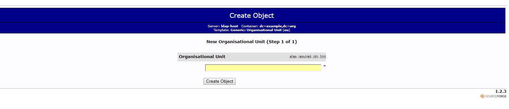
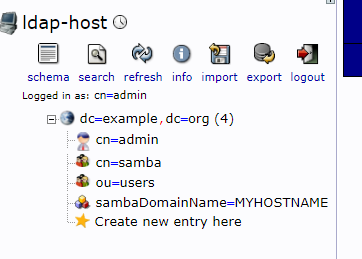
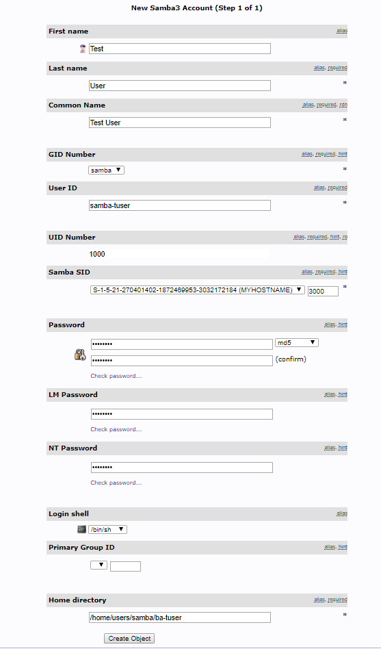
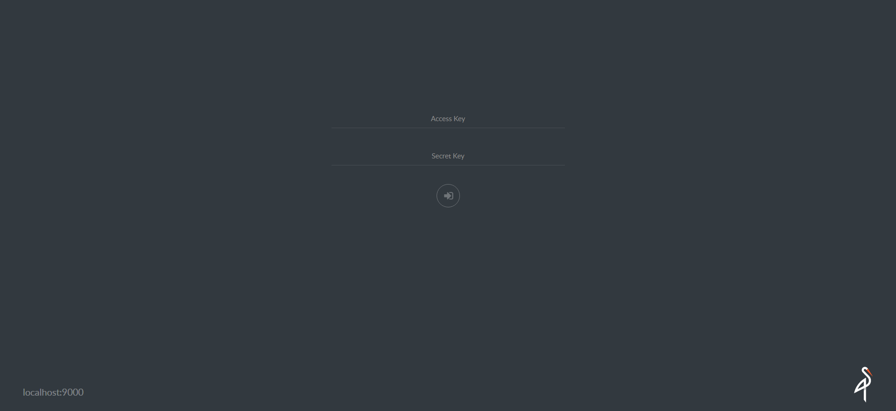
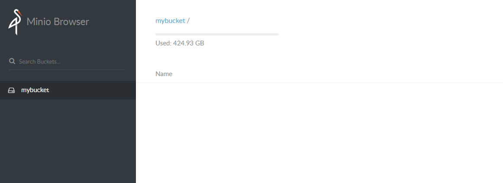
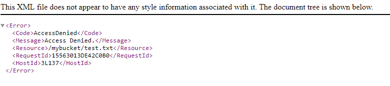

# Storage and Network File Systems

Network File Systems and access control

## Part 1: SMB and PAM

Simple SMB server using Samba. Access control will be controlled by simple Samba users and PAM.

#### Goals

1. Setup a Simple Samba Server
2. Demonstrate how to start and stop services on Linux (Ubuntu)
3. Demonstrate how to create a user and file share on the server.
4. Start a Linux client, and mount the new share to the clients filesystem, demonstrate how the file is really created on the server from the client.

#### Step 1: Setup the server

The server has the proper dependencies and packages pre installed.

Lets start by brining up our docker environment. Open you terminal and navigate to the folder that contains the docker-compose file for part 1. And the docker-compose up

```
$ docker-compose up -d
```

You should see something similiar to the following screen.

```
Creating network "part1_default" with the default driver
Creating part1_server_1 ... done
Creating part1_client_1 ... done
```

So now the server and client are running waiting to be setup!

First docker exec into the server

```
$ docker exec -it part1_server_1 bash
```

Once at the server container root prompt, lets setup the server. First we need to add a new user that will allow us to connect to our share. When is asks for a password use something easy to remember

```
$ useradd ist-t-user --shell /bin/false
```

This will add a new user with the username ist-t-user, the --shell flag does not allow the user to login to the server.

Next we need to create a home directory for the user and give the new user ownership of the directory

```
$ mkdir -p /home/ist-t-user
$ chown ist-t-user:ist-t-user /home/ist-t-user

# ls command lists the directory and ownership info
# Should show that ist-t-user owns the directory
$ ls -l /home
total 4
drwxr-xr-x 1 ist-t-user ist-t-user 4096 Sep 12 03:08 ist-t-user
```

Now we need to configure Samba to share the directory with clients to do this we need to edit the smb.conf file that is installed with Samba. We do this with the nano editor using the command below.

```
$ nano /etc/samba/smb.conf
```

The file contains an enormous amount of configuration options. We are going to go right to the bottom of the file and add the code below

```
[myshare]
path = /home/ist-t-user
valid users = ist-t-user
available = yes
browsable = yes
public = yes
writable = yes
read only = no
```

What's this? this tell samba to expost the path /home/ist-t-user and call it myshare. The only user that can access this share is ist-t-user. The other options allow for browsability and access.

Once you add the above code to the smb.conf file you should test it for errors.

```
$ testparm
```
When you run this it will ask you to hit enter, and you will see an output similiar to the one below

```
Load smb config files from /etc/samba/smb.conf
WARNING: The "syslog" option is deprecated
Processing section "[printers]"
Processing section "[print$]"
Processing section "[myshare]"
Loaded services file OK.
Server role: ROLE_STANDALONE

Press enter to see a dump of your service definitions

# Global parameters
[global]
        server string = %h server (Samba, Ubuntu)
        server role = standalone server
        map to guest = Bad User
        obey pam restrictions = Yes
        pam password change = Yes
        passwd program = /usr/bin/passwd %u
        passwd chat = *Enter\snew\s*\spassword:* %n\n *Retype\snew\s*\spassword:* %n\n *password\supdated\ssuccessfully* .
        unix password sync = Yes
        syslog = 0
        log file = /var/log/samba/log.%m
        max log size = 1000
        dns proxy = No
        usershare allow guests = Yes
        panic action = /usr/share/samba/panic-action %d
        idmap config * : backend = tdb


[printers]
        comment = All Printers
        path = /var/spool/samba
        create mask = 0700
        printable = Yes
        browseable = No


[print$]
        comment = Printer Drivers
        path = /var/lib/samba/printers


[myshare]
        path = /home/ist-t-user
        valid users = ist-t-user
        read only = No
        guest ok = Yes
```

If there is an error it will tell you, the output below is shortened so you can see the error.

```
Load smb config files from /etc/samba/smb.conf
WARNING: The "syslog" option is deprecated
Processing section "[printers]"
Processing section "[print$]"
Processing section "[myshare]"
Unknown parameter encountered: "pathjk"
Ignoring unknown parameter "pathjk"
WARNING: No path in service myshare - making it unavailable!
NOTE: Service myshare is flagged unavailable.
Loaded services file OK.
Server role: ROLE_STANDALONE

Press enter to see a dump of your service definitions
...
```

Can you see what the error is?

After the server setup is complete and there are no errors we can start the service.

First check the status.
So see the status of a service, you can use the following command

```
$ service samba status
* nmbd is not running
* smbd is not running
```

Currently our service is not running, lets fix that.
user the service command to start samba, you will see the output below.

```
$ service samba start
* Starting NetBIOS name server nmbd       [ OK ]
* Starting SMB/CIFS daemon smbd           [ OK ]
```

To stop a service use the following command, if you stop it don't forget to start it again before moving onto the client setup!

```
$ service samba stop
* Stopping Samba AD DC daemon samba           [ OK ]
* Stopping SMB/CIFS daemon smbd               [ OK ]
* Stopping NetBIOS name server nmbd           [ OK ]
```

At this point you can exit the container, or open a new terminal to access the client.

#### Access the share from a client

To access the running client use docker exec

```
$ docker exec -it part1_client_1 bash
```

Once logged in you can view the shares provided by the server using the command below.

```
$ smbclient -L //server -U ist-t-user

WARNING: The "syslog" option is deprecated
Enter ist-t-user's password:
Domain=[WORKGROUP] OS=[Windows 6.1] Server=[Samba 4.3.11-Ubuntu]

        Sharename       Type      Comment
        ---------       ----      -------
        print$          Disk      Printer Drivers
        myshare         Disk
        IPC$            IPC       IPC Service (35f96533555e server (Samba, Ubuntu)) Domain=[WORKGROUP] OS=[Windows 6.1] Server=[Samba 4.3.11-Ubuntu]

        Server               Comment
        ---------            -------
        35F96533555E         35f96533555e server (Samba, Ubuntu)

        Workgroup            Master
        ---------            -------
        **WORKGROUP**
```

We can see that the *myshare* that we created listed in the output

To actually use the share, we need to mount it to the client file system. To do this we use the *mount* command.

```
$ mkdir /mnt/myshare
$ mount -t cifs -o user=ist-t-user //server/myshare /mnt/myshare
```

after entering the password the shared path is now mounted to the local filesystem, and we can interact with it just like it was part of the client.

We can create files

```
$ echo "my new file" > /mnt/myshare/test.txt
```

We can list the files (You should see the test.txt file that was created above)

```
$ ls /mnt/myshare
```

Now lets check the server, if you exited before, open a new terminal and docker-exec into the server.

```
$ docker exec -it part1_server_1 bash
```

List the items in the share, we should see the new test.txt file!

```
$ ls /home/ist-t-user
test.txt

$ cat test.txt
my new file
```


- Show shares using samba client
- Connect to samba share using client
- Mount folder using mount command
- Navigate to directory, add a file and some text
- Show on server that file is there

## Part 2: Samba with LDAP

In the next part we will use an ldap server to control authentication of users and control the authorization fo mounts. Much of this is already done for you.

https://www.techrepublic.com/article/how-to-populate-an-ldap-server-with-users-and-groups-via-phpldapadmin/

### Walkthrough

Lets get started. Navigate to the part2 folder and start the environment

```
$ docker-compose up -d
```

This will create 4 containers. The LDAP server, the phpLDAPadmin web interface, the Samba server, and the client we will use to connect to the server.

Once all of the containers start you should be able to navigate to the web interface at [http://localhost:9080](http://localhost:9080) in your browser.


To login to the interface click **login** on the left. You can login with the following credentials

```
Login DN: cn=admin,dc=example,dc=org
Password: admin
```

Once Logged in you will see the following screen.



Before we can start using samba we need to add a few things to our ldap directory.

First we need to create a Samba Posix Group.
1. Click on the root of the tree.
2. Click Create a child entry in the list of options that appear
3. Choose Generic Posix Group
4. For Group name just enter "samba"

5. Click create object and then commit

Now we need to create a **users** group
1. Click create child entry under the root again
2. Choose Generic Organizational Unit
3. Enter *users* for the name

4. Click Create Object and then commit

Your Organization Directory should no look like the following:


Now we need to create a user.
1. Click on the **ou=users** group in your directory tree. Then choose **Create child entry**.
2. Choose **Samba Account**
3. Fill out the following form with the information below, remember the password you enter. Some of the values may be slightly different on your machine.

4. Click Create Object then commit on the following screen
5. To get our user to work with our setup we need to add a couple of attributes to our user. Your org tree should now look like the following

Click on the user in your tree to the left.
6. Click on Add new attribute from the choices at the top.
7. Select **sambaPwdMustChange** from the choices and enter **-1** for the value.
8. Click Update Object at the bottom, then Update Object again.
9. Click on Add new attribute again
10. Select **sambaPwdLastSet** from the choices and enter **-1** again for the value
11. Click Update Object again.

Our LDAP server is now ready to use!

Lets try our client

1. Open a new terminal and login to the client using docker.
```
$ docker exec -it part2_client_1
```
2. Mount the new drive to your home directory, is real life this would be done for you automatically when you login. 
```
$ mount -t cifs -o user=samba-tuser //smbserver/samba-tuser /home
```
3. Navigate to you new mounted share
```
$ cd /home/samba-tuser
```
4. And Create a new file
```
$ echo "my test file" > test.txt
```
5. You should see the new file appear on your host machine under the part2/shares directory. This is the network share working. How?

When you start docker, the smbserver container mounts your host folder into the container. When you mount that folder from the smbserver the smbserver checks with the ldap server for authentication and if successful it then allows the mount to happen. From the client you can now create and edit files on the server just like they were part of the client machine! In the real world this would happend automatically for you when you login, kind of like how your H: drive is automatically available when you login to a computer on campus.

#### Other thing to try

- Create another user, mount that directory to your client also.
- Scale you clients to 2 or 3, follow the instructions to mount a share in each one, notice that updates you make on one appear in the other(s).

## Part 3: Cloud Storage with Minio (Self Hosted S3)

In this part we will utilize cloud storage provided by Mino. Minio is a self hosted S3 compatable object storage. S3 is a very popular storage system used worldwide. This lab demonstrates how S3 protects files utilizing bucket policies. Minio only uses one user, but in S3 you can create a policies for many users.

#### Goals

1. Run a Simple Minio server
2. Interact with the server utilizing the minio client.
3. Demonstrate simple bucket policies and setting the with the client.
4. Interact with Minio through the user interface.

## Walkthrough

Begin by starting you Minio environment. Navigate to part3 of the lab and issue the command below.
```
$ docker-compose up -d
```

Once the container starts you should be able to navigate to [http://localhost:9000](http://localhost:9000) in your browser. If everything is working you should see the following screen.



Login to the user interface with the following credentials.

```
minio
minio123
```

Bucket is basically a root folder to store files in Minio. To create a bucket click the + button in the lower right corner. Choose create bucket. Then enter a name, in our example we use **mybucket**.



Now that we have a bucket, lets use the client to upload a file. We will be using the minio client to interact with our server.

```
$ docker run -it -v testfile/test.png:/testfile/test.png --link part3_minio_1 --entrypoint=/bin/sh minio/mc:edge
```
*We are using the edge tag because of an error, if having problems remove the edge take*

Configure the client to work with our server.
```
# USAGE:
#  mc config host add ALIAS URL ACCESS-KEY SECRET-KEY

mc config host add myminio http://part3_minio_1:9000 minio minio123
```

Once the server is added lets upload a test file

```
# First create a file
$ echo "<h1>Test File</h1>" > test.html

# Upload
$ mc cp test.html myminio/mybucket
```

If you refresh your browser you should no see the file we uploaded.

To see the default bucket policy which is deny all, navigate to the file in your browser.

[http://localhost:9000/mybucket/test.html](http://localhost:9000/mybucket/test.html)

You should see something like the image below


Well thats a problem, lets fix that. This is done by setting bucket policies to allow access. We will keep it simple and just let everyone see it.

Back on the minio client run:
```
$ mc policy public myminio/mybucket
```

This sets allow public access, so you can now go to the file in the browser, and you should see **Test File**

[http://localhost:9000/mybucket/test.html](http://localhost:9000/mybucket/test.html)

This is just a very simple example of how a bucket policy works. The real s3 has more advanced policy, but his is just a quick introduction to how storage works in the "cloud".