# Cloud Computing

Cloud Computing, Using 3rd party services for web application authentication. Working on your app and deploying to **ANY** cloud!

## Goals

- Install third party authentication plugin for Drupal. 
- Once plugin is installed and working create a new docker images with the changes to software
- Push new image to docker registry
- deploy new image to a cloud environment running on heroku


## Step 1: Create a new Heroku account

Heroku is a cloud provider that usitlized Amazon Web Services to deploy resources. We are using Heroku because they have a very easy to use user interface and offer a very generous free package to developers just getting started.

You can sign up for a free account at [https://www.heroku.com/](https://www.heroku.com/)


Once you get access to your free account, and reach the dashboard. Continue on to the next step.

## Step 2: Create a cloud database

For this lab we are going to create a cloud database to work with, this will cut down the need to migrate data between your computer and Heroku, which is beyond the scope of this class. 

1. If not already, login to Heroku
2. Create a new app to deploy to.
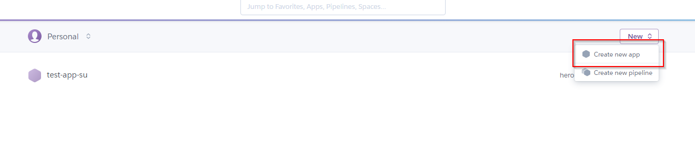
3. Give your new app an easy to remember name, and click create
4. Back at the dashboard, click the name of your new application.
5. Under the app overview, click on configure add-ons
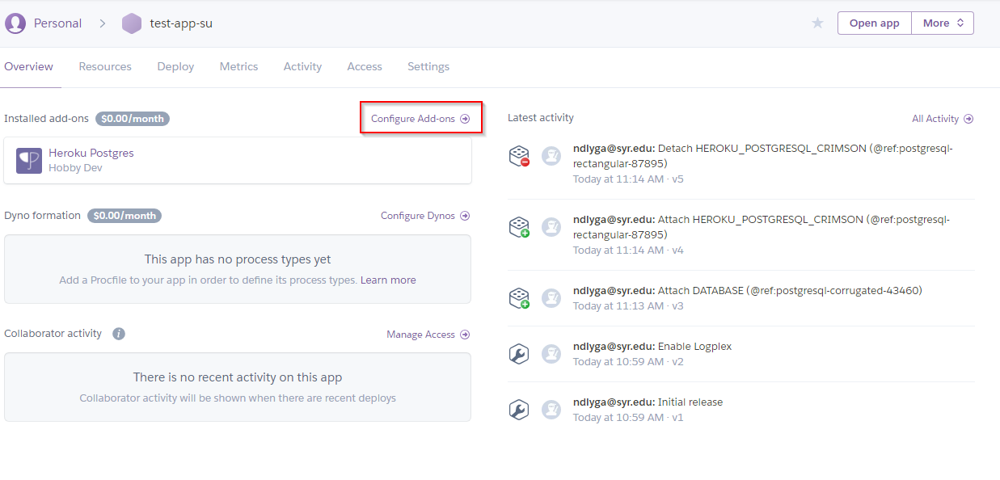
6. On the next screen search for PostgreSQL
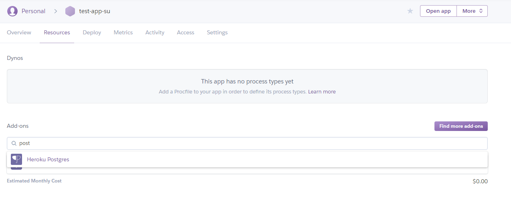
7. Click on Heroku Postgres and follow the prompt for the free dev version.
8. Once the database is created you can cick the database under your app's overview tab (see 5)
9. Click the settings tab, then the view credentials button and you should see the setting for your database, it will look like the screen below.
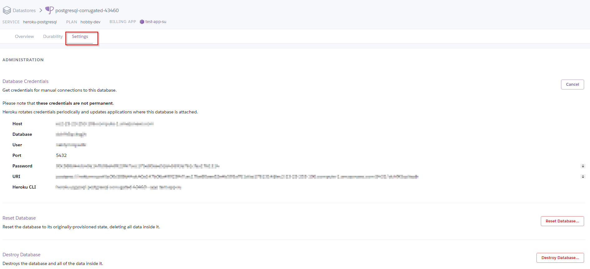
10. Copy these settings you will need them to install Drupal in the next steps.

**NOTE: Did you screw up?? No big deal you can reset you database in the same location in the settings. This will clear you database and allow you to start over**

## Step 3: Get Drupal Running Locally.

To get started start the up the Drupal application. Navigate to the lab-I folder in you terminal. Then run the docker-compose up command to bring up the container

```
$ docker-compose up -d
```

Once the containers begin to run navigate to the locally running drupal install [http://localhost:8080](http://localhost:8080)

**WARNING: DUE TO THE USE OF A CLOUD DATABASE YOUR WEBSITE WILL BE SLOW**

You should see the Drupal installation screen, enter relavant information for your website. For your database, use the settings that you copied from Heruko, some of the settings are available under the advanced area. See below **MAKE SURE YOU USE YOUR SETTINGS!!**
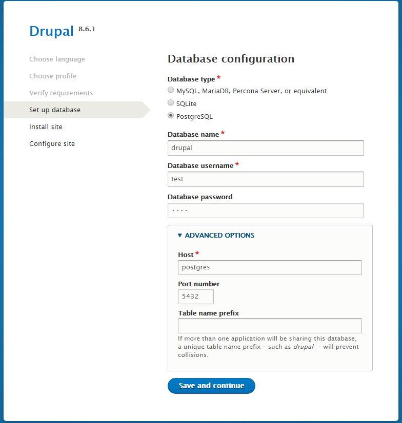

Continue with the installation until you reach the screen below. (Takes about 15 minutes)

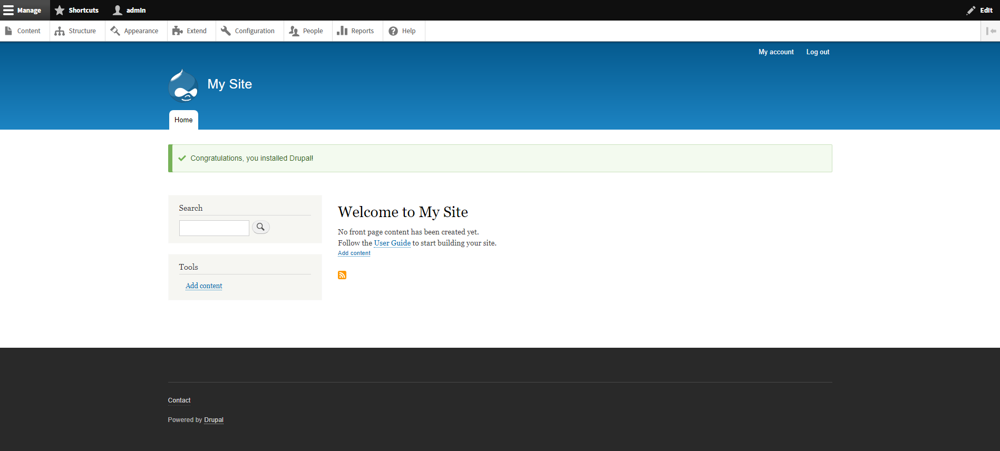


## Step 4: Sign up for Auth0

Auth0 is a third party authentication service that allows are application to authenticate from a variety of sources. It is also free to get started and try out. Auth0 uses the OAuth2 authentication protocol to authenticate users. This protocol is used by a variety of vendors such as Facebook, Twitter, Microsoft and Google. You can learn more about [OAuth2](https://oauth.net/2/) on the web

1. [Create an Auth0 account](https://auth0.com/signup?&signUpData=%7B%22category%22%3A%22button%22%7D)
2. Once your account is created, you should have access to the dashboard shown below
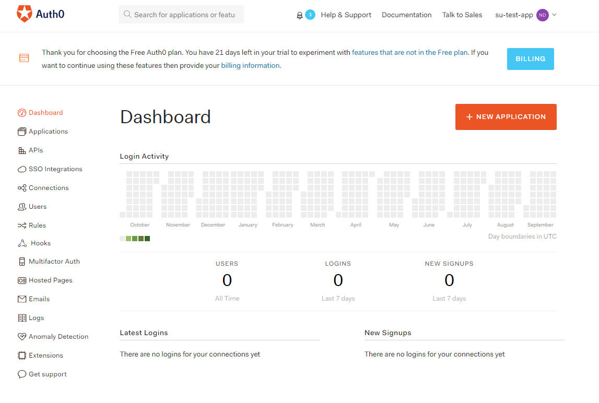
3. Click the button to create a new application
4. Name your application, select **Regular Web Applications** and click **Create**
5. You will now see your new application under **Applications** on your dashboard.
6. Click on the application, and click the setting tab to view the settings, you will need these later
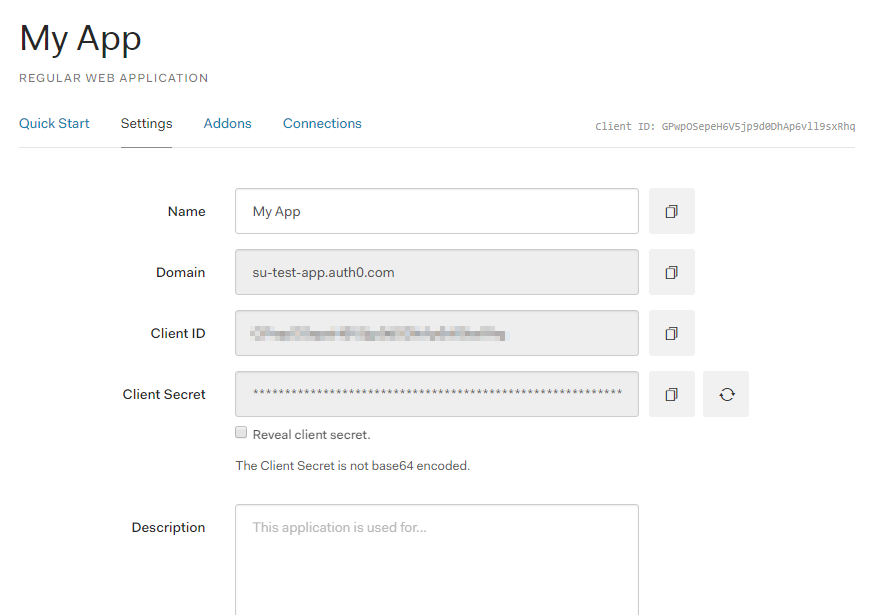
7. Enter the urls show below in the correct area, then click **Save**, Remeber this, you will need to add more later!!
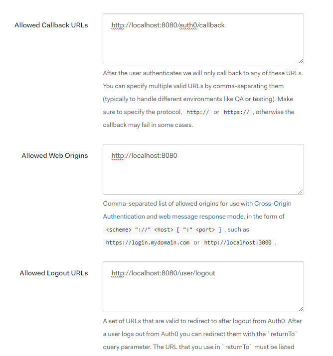


## Step 5: Install the Auth0 Module for your Drupal site

Now that Auth0 is setup we can install the Auth0 drupal module, the module is already installed on the website, but it still needs to be configured 

1. On you drupal site, click the **Extend** button at the top. 
2. Find the newly installed Auth0 plugin, check the box next to it, and click enable.
3. Once the plugin is enabled, click the **Configuration** button at the top. If everything is correct you should see the Auth0 settings under system (show below)
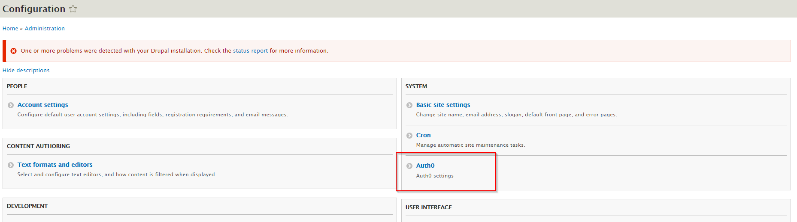
4. Enter the settings retrieved from Auth0 like below
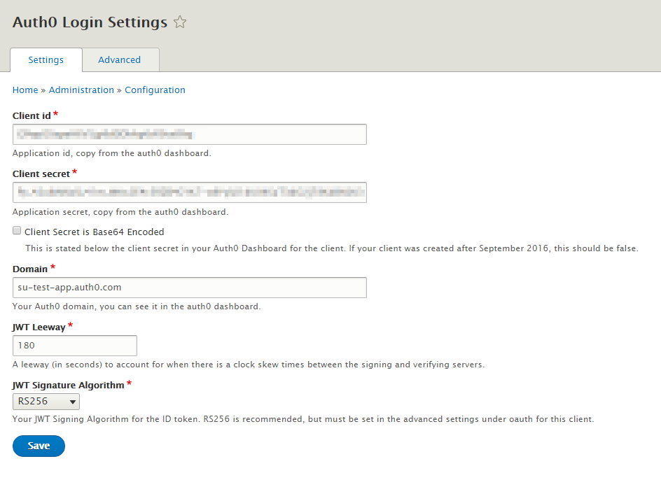
5. Click Save
6. You application should now be using Auth0 for authentication! Open up an incognito window or logout and try to login using the Auth0 and a google account, or your g.syr.edu google account.

## Step 6: Commit and Push to the Heroku Registry.

Whew!! that was a lot of work, but what happens when I restart my container? EVERYTHING WILL BE GONE! 

Lets create a new image with all of the changes we made to our application.

1. Create a new image of our drupal website use the right app name!
```
# docker commit lab-i_drupal_1 registry.heroku.com/<YOUR_APP_NAME>/web
$ docker commit lab-i_drupal_1 registry.heroku.com/test-app-su/web
```
2. Install the Heroku CLI for you computer by following the [installation instructions](https://devcenter.heroku.com/articles/heroku-cli). We need the CLI because it makes authenticating with Heroku painless.
3. After installation you will need to open a new terminal window, then login to Heroku
```
$ heroku login
```
4. Then you need to login to the container registry
```
$ heroku container:login
```
5. Once logged in you can push your new image
```
# MAKE SURE YOU USE THE USE THE CORRECT IMAGE FROM FROM STEP 1
$ docker push registry.heroku.com/test-app-su/web
```
6. Then deploy the app!
```
# First you need to allow apache to run in Heroku (Your only need to run this once)
$ heroku labs:enable -a <YOUR-APP-NAME> runtime-new-layer-extract

# heroku container:release -a <YOUR-APP-NAME> web
$ heroku container:release -a test-app-su web
```
7. Now see if your application deployed! Go to Heroku, click on your application and click open app in the upper right corner of the screen!

**NOTE: Want to see whats happening in Heroku?**
```
$ heroku container:release -a <YOUR-APP-NAME>
```
This will show your the logs to help understand what is happening, or see any errors.

**NEED HELP?: [See the developer docs on Heroku](https://devcenter.heroku.com/articles/container-registry-and-runtime)


