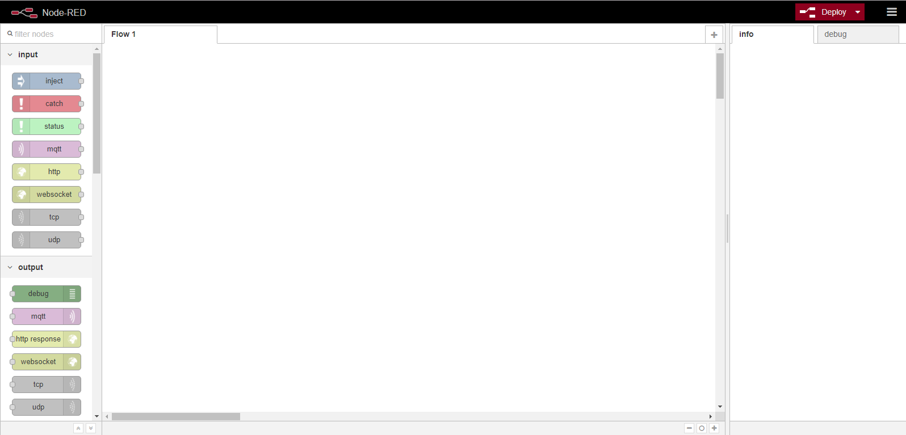
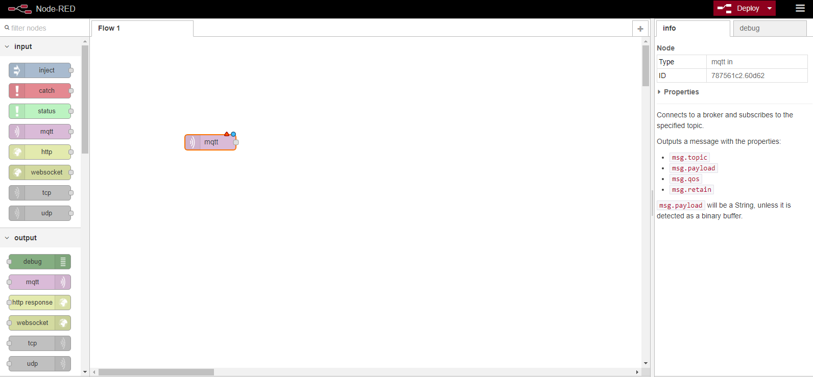
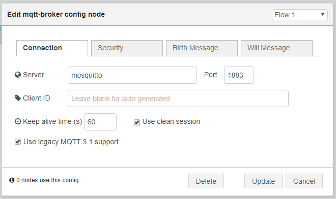
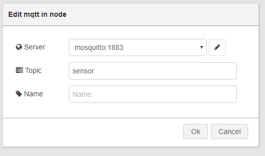
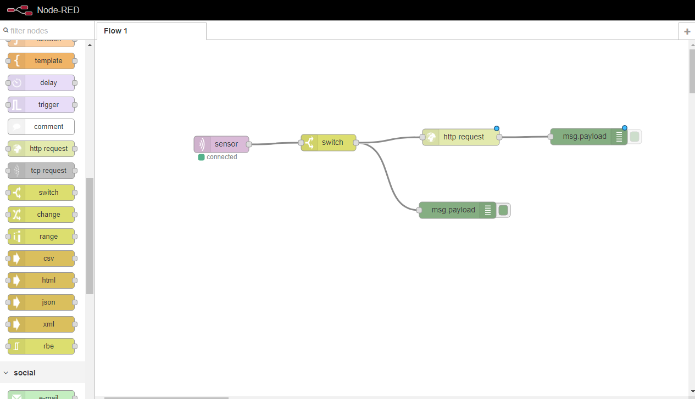

# M - Internet of Things

## Goals:
- Demonstrate how an internet of things environment works.
- Run environment with a device and Node Red
- Configure Node Red to access capture the output of the device.
- Configure Node Red to alert someone when the device reads empty.

## IOT devices and networking

Anything connected to a network can be an IOT device, your cell phone, a sensor, another computer, camera, etc. In the lab today you will run a fake sensor that sends information on how full or empty a container is. It sends this data in the form of a percentage.

## Start the environment

Before we get started, open the docker-compose.yml file in the Lab-M folder and add your email address and smtp settings where indicated under the sendmail section.

Start the environment using docker-compose

```
PS C:\IST346\ist346-labs> docker-compose up -d --build
```

This take a while, the sensor image is large.

Once everything starts you should be able to navigate to you fake sensor [http://localhost:9393/](http://localhost:9393/)

Feel free to try the sensor out a few times, you will see the output of the sensor at the bottom of the page.

Currently the sensor doesn't really do anything. To actually use the data from the sensor we are using [Node Red](https://nodered.org/) an easy to use tool for wiring together devices on a network.

To access Node Red navigate to [http://localhost:1880/](http://localhost:1880/) in your browser, you should see a screen like the one below:



Our device is using the MQTT protocol, to access our device we need to add a mqtt input. You can do that by dragging and dropping the input from the left to the blank area on the screen.



Right now the input is not connects, to configure that double click on the input you dropped onto the screen. When the modal opens you will need to add a broker by clicking the pencil on the right of the server input box

Enter the information shown below and click Save/Update



On the first Modal enter **sensor** for the topic. See the next screenshot



If everything is correct you should see the red triangle go away, and only see a blue circle on the purple box labeled **sensor**.

Now add a debug output box to the screen, and drag a connector from the sensor (purple) to the msg.payload debug box (green) see below.


Then click the red Deploy button in the upper right corner of the screen, this activates our workflow.

Open the debug tab on the right side of the screen, then go back to or open a new window with our sensor [http://localhost:9393/](http://localhost:9393/), and go ahead and try the sensor again, you should be able to now see the output in the debug window. If everything is correct you should see something similar to the screenshot below.


Great, but this isn't really doing anything yet, We are really only interested when one of the containers are empty, this way we can refill the container and keep our customers happy.

To do that we need to add a switch, that only activates our debug message when a container is empty. To do that add a switch and connectors like the screenshot below.


Double click on the switch and edit the configuration like the one shown below:


Now click deploy in the upper right of the screen and lets test the sensor again. This time you should only see a message in the debug area when the sensor reaches 0. If you see all the output still, double check your settings.

Once everything is working, wouldn't this be a lot better if someone was alerted when a container was empty so they could refill it?

In the lab we created a mail sending service that exposes an endpoint that accepts requests to send an email.

To get node red to send alert to that endpoint when the container is empty we need to add another function node called **http request** and the proper connectors, your screen should now look like the screenshot below.



Double click on the http request node to open the configuration screen, edit the configuration like the one shown below:


Click deploy to publish our new workflow. Go back to the sensor and test it again, if everything is working you should get an email that the container is empty!


